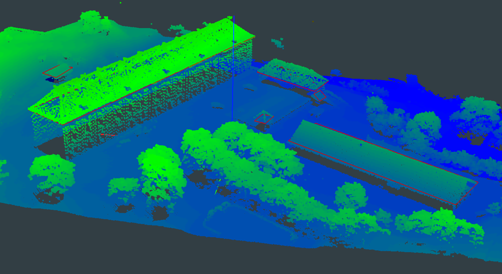

# Retrouver les contours des toits des bâtiments en 3D

Ce répertoire permet de reconstruire en 3D les contours de toit (script SamonGouttiere.py).
Il a permis il fut un temps un temps de recaler les bâtiments de la BD Uni sur les contours de toit trouvés précédemment (script v1/run_recalage.py). Mais cette fonctionnalité n'a plus été maintenue.





## Mise en place d'un chantier

Dans un répertoire chantier doit se trouver :
* Un répertoire "gouttieres" contenant un répertoire "predictions_FFL" avec les prédictions du Frame Field Learning sous format shapefile
* Un répertoire "mnt" contenant un fichier vrt
* Un répertoire "orientation" contenant le TA sous format xml. Il se trouve généralement dans store-ref/ortho-images/ImagesOrientees/FD[departement]/annee/[...]_AERO/AERO/[...]/*_adjust.XML
* Un répertoire "raf" contenant la grille RAF
* Un répertoire "pvas" contenant les images orientées

Eventuellement, il peut s'y trouver :
* un fichier shapefile (ou geojson) de l'emprise du chantier qui nous intéresse.
* un fichier contenant les bâtiments de la BD Uni à recaler.
* un répertoire contenant le lidar de la zone pour contrôler les résultats


## Installation

Création de l'environnement conda : 
```
mamba env create -f v1/environment.yaml
conda activate samon
```

## Exécution de l'algorithme

```
python samonGouttiere.py --input [répertoire] --emprise [emprise]
```


Pour convertir le résultat en fichier obj :
```
python script/convert_to_obj.py --input [répertoire]
```


## Les fichiers résultats

Dans plusieurs répertoires, on trouve deux types de fichiers shapefile : avec ou sans le suffixe "_proj". Ceux sans le suffixe sont dans la géométrie image, ceux avec le suffixe sont projetés sur le MNT et permet de superposer les shapefiles issus de pvas différentes. 

Dans chantiers/gouttieres :
* nettoyage : prédictions du FFL où chaque segment correspond à un mur (sans points intermédiaires dans la géométrie)
* association_batiment : un bâtiment possède le même identifiant dans les différents fichiers shapefile
* association_segments : un bord de toit possède le même identifiant dans les différents fichiers shapefile
* intersections : position 3D des bords de toit.
* batiments_fermes : on ferme les bâtiments à partir des bords de toit trouvés à l'étape précédente. intersections.gpkg contient les bords de toit ajustés lorsqu'ils intersectent d'autres bords de toit. batiments_fermes.gpkg contient les batiments fermés (après regroupement des bords de toit)


## Trois zones d'études

Les résultats ainsi que les fichiers intermédiaires pour trois zones d'études se trouvent dans [resultats](resultats/).


## Pour s'amuser

L'algorithme est compatible avec les orientations Micmac produites par Pompei pour les images historiques.
Pour cela : 
* les pvas sont les images OIS-Reech corrigées de la distorsion : dans Pompei, lancer distorsion_correction.py et récupérer les images qui sont dans le répertoire images_without_distorsion
* Mettre la totalité des fichiers xml présents dans Ori-TerrainFinal_10_10_0.5_AllFree_Final et les mettre dans le répertoire orientation
* Appliquer sur les images orientées un algorithme de contour de bâtiments

Puis lancer la ligne suivante :
```
python samonGouttiere.py --input [répertoire] --emprise [emprise] --pompei True
```